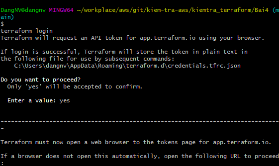

-Tạo workplace:
+ Chọn CLI-driven workflow
+ Điền tên ấn create workspace

- tạo variable sets

- login terraform cloud

- điền token 

- thêm configuration

- chạy lệnh terraform init

- chạy lện terraform apply --auto-approve

